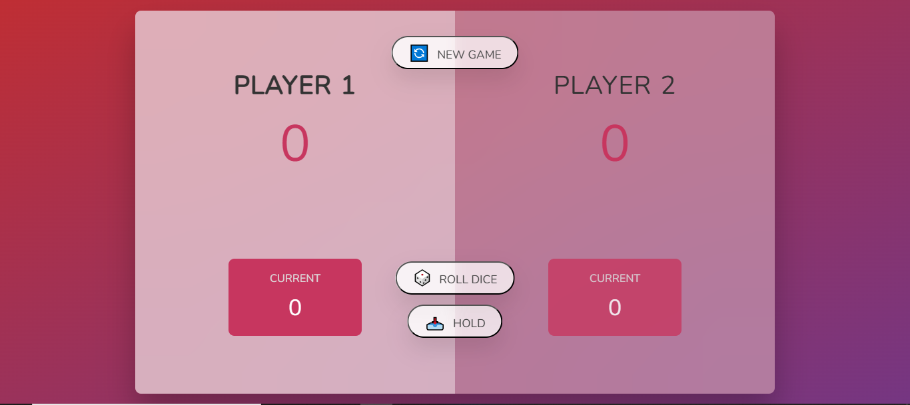

# Pig Game 🎲

A simple two-player dice game called "Pig" where players take turns rolling a die, accumulating points, and holding to add to their total. The first player to reach 100 points wins.

## 📖 Overview

- Players alternate turns rolling a single die.
- On each roll:
  - If the die shows 1, the player's current turn score resets to 0 and the turn switches.
  - Otherwise, the roll value adds to the player's current score.
- The **Hold** button adds the current score to the player's total and switches turns.
- The **New Game** button resets all scores and restarts the game.

## 🚀 Features

- 🎲 **Roll Dice**: Generates a random roll from 1 to 6, updates the current turn score.
- 📥 **Hold**: Banks the current turn score into the total score and switches the active player.
- 🔄 **New Game**: Resets scores, hides the die, and restarts the game state.
- 🏆 **Victory Condition**: First player to reach 100 total points wins; UI highlights the winner.

## 🖥️ Demo



> _Click **Roll dice** to play, **Hold** to bank points, and **New game** to reset._

## 🛠️ Tech Stack

- **HTML5** for semantic structure
- **CSS3** for styling and responsive layout
- **JavaScript (ES6+)** for game logic and DOM manipulation

## 📁 File Structure

```plaintext
pig-game/
- ├── index.html     # Main markup for players, controls, and die image
- ├── style.css      # Game styling: layout, colors, active/winner states
- ├── script.js      # Game logic: roll handling, hold, turn switching, reset
- ├── image/         # Dice face images (dice-1.png through dice-6.png)
- └── README.md      # Project documentation (this file)
```

## ▶️ How to Play

- Open index.html in your browser.

- Click Roll dice to roll the die and accumulate points.

- If you roll a 1, your turn ends and your current points reset.

- Click Hold to save your accumulated points to your total and pass the turn.

- First player to reach or exceed 100 points wins the game.

- Click New game at any time to reset and start over.
